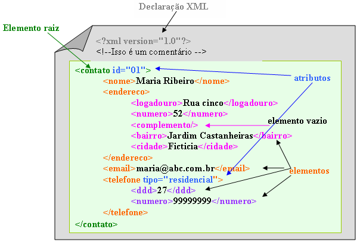

<h1>🗂 Estrutura do documento XML</h1>

O XML é um formato para a criação de documentos com dados organizados de forma hierárquica, basicamente como uma árvore.

Sua estrutura consiste em:

- Instrução de processamento, geralmente no cabeçalho;
- Declaração de entidades;
- Suas tags, de inicio e fim;
- Respeito ao posicionamento de suas tags.

Vale ressaltar que os elementos de um XML não devem ser sobrepostos

<h3>Exemplo de um XML com dados sobrepostos, ou seja, inválido</h3>

~~~~xml

<titulo>XML é melhor que JSON
    <subtitulo>Isso aqui vai dar muito ruim</titulo></subtitulo>
~~~~

*Exemplo ruim tirado da minha cabeça*

<h3>Como se da a estrutura do documento XML?</h3>

*Exemplo retirado do blog da Loiane Groner*

Vamos entender a imagem. O XML possui algumas caracteristicas, como discutido anteriormente e visualizado na imagem. A primeira delas é o cabeçalho do XML, que vai conter informações referentes a sua versão, a sua validação etc. Além disso, cada **tag** representa um **elemento** e esse elemento pai pode possuir elementos filhos e/ou **atributos**, como observado na imagem.

[Próxima sessão ➡️](dtd.md)